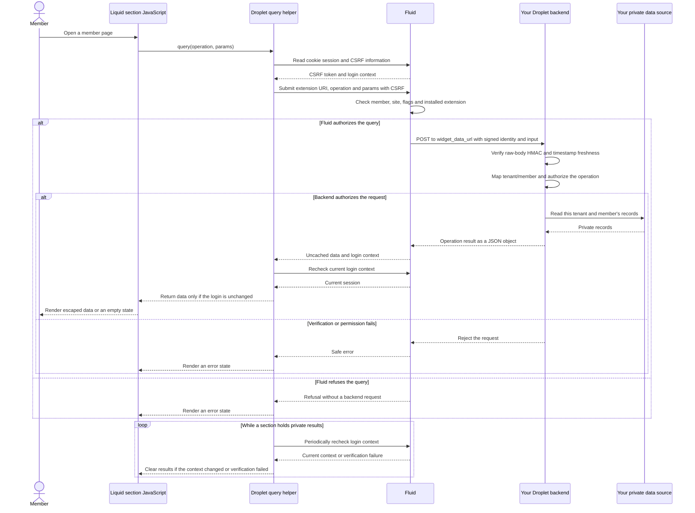

<Warning>
This connection requires the member-storefront pilot, the `MEMBER_STOREFRONT_DROPLET_DATA` company flag, the member-query API deployment, and Member Storefront SDK **0.11.0** or later. Confirm availability with Fluid before enabling it. The helper URL below works only after that SDK release is published.
</Warning>

An installed Droplet section can query its backend on a signed-in member's **account-host page**. Fluid authenticates the member, checks the installed extension, and signs the backend request. The section receives the returned JSON and renders it in the browser.

This connection covers member storefront sections and app blocks. It does not enable private queries on public storefront pages, Portal, or mobile apps. It does not give the section a member bearer token, the Droplet webhook secret, or backend credentials.

## What you need before connecting

| Component | Required setup |
| --- | --- |
| Droplet | Register a Droplet that is permitted to run, with an active installation in the member's company. |
| Theme extension | Publish the Droplet's theme extension with an active section or app block. |
| Data endpoint | Set the Droplet's `widget_data_url` to a public HTTPS endpoint that accepts signed JSON POST requests. |
| Signing secret | Store the same Droplet's `webhook_secret` in your backend's secret storage. |
| Member storefront | Enable both `MEMBER_STOREFRONT` and `MEMBER_STOREFRONT_DROPLET_DATA` for the test company after the API and SDK release are available. |
| Member access | Use a real signed-in member who can access the member site on its live account host. |
| Private data | Maintain a mapping from the signed Fluid company/member identity to the tenant and member in your own data source. |
| Section script | Load SDK 0.11.0 or later, supply the installed template's `extension_uri`, and implement `onInvalidate` to clear private content. |

The theme extension supplies the markup and JavaScript; your backend supplies the private data. Keep credentials for Exigo or any other data source on your backend. The browser renders only the result authorized for the current member.

See [package and publish an extension](/themes/droplet-theme-extensions) and [place it on a member page](/themes/member-storefront/droplet-widgets) for the section setup.

## How the data reaches the section

1. The section calls `client.query("commissions.summary", {})`.
2. The helper obtains same-origin session and CSRF information, then submits the operation and extension reference to Fluid.
3. Fluid checks the live member/site access, company flags, active installation, published extension, and active section or block.
4. Fluid signs the server-derived member and company context, then posts to the Droplet's registered `widget_data_url`.
5. Your backend verifies the signature and timestamp, checks the member's permissions, and returns a JSON object.
6. The helper checks that the login has not changed. Your section renders the object or an empty/error state.



The section chooses an **operation name**, not a backend URL or route. You can add `commissions.history` alongside `commissions.summary` in your backend and section code without adding a Fluid route.

## Prepare the backend

Configure your Droplet's `widget_data_url` with one publicly reachable HTTPS endpoint. Keep its existing webhook secret on your backend. Fluid refuses private-network destinations and redirects.

### Register the destination and save the secret

Use the Droplet-management API in your integration to configure `widget_data_url`, for example `https://commissions.northwind.example/member-data`. Droplet creation and updates accept this field. Changing the endpoint in your section's settings does not register a backend destination.

Fluid returns `webhook_secret` when you create the Droplet; save it securely at that point. Ordinary Droplet read and update responses do not return this secret. Confirm that your backend has the original secret before testing an existing Droplet.

The data request uses this Droplet-level secret for signature verification. Installation access tokens have a separate purpose when your backend calls Fluid APIs. Keep both credentials on the server.

`embed_url` is the Droplet's embedded application UI address. Install and uninstall webhook URLs receive lifecycle events. The member-data request goes to `widget_data_url`.

Deploy a handler at the exact registered URL and preserve its raw request body until signature verification finishes. For local development, register your HTTPS tunnel's endpoint and keep the secret in the local backend environment.

The signed JSON has this shape:

```json
{
  "operation": "commissions.summary",
  "params": { "period": "2026-09" },
  "widget_type": "fluid://extensions/42/sections/commission_summary",
  "company": { "id": 1842, "fluid_shop": "northwind.fluid.app" },
  "member": {
    "id": "01990000-0000-7000-8000-000000000001",
    "public_id": "01990000-0000-7000-8000-000000000001",
    "external_id": "exigo-4821"
  }
}
```

`company` identifies the requesting member's company, which can differ from the Droplet publisher. Treat the member identifiers as opaque. Use the signed tenant plus `member.public_id` for your mapping, or a verified tenant-scoped mapping of `member.external_id`. The external ID may be null.

`widget_type` identifies the installed extension template. It is not proof that a particular script initiated the call. Values under `params` are untrusted operation input, even though their bytes are covered by the signature. Never use an ID inside `params` to override the signed company or member.

### Verify the raw body

Verify `X-Fluid-Signature` using the Droplet webhook secret and HMAC-SHA256 over the exact bytes of `X-Fluid-Timestamp + "." + raw_body`. Do this before JSON parsing or any data lookup. Compare signatures in constant time and reject timestamps outside your accepted freshness window.

This Node example accepts a five-minute window:

```javascript
import { createHmac, timingSafeEqual } from "node:crypto";

function verify(rawBody, headers, secret, now = Date.now()) {
  const timestamp = headers["x-fluid-timestamp"];
  const signature = headers["x-fluid-signature"];
  if (!secret || typeof timestamp !== "string" || !/^\d{10}$/.test(timestamp)) return false;
  if (typeof signature !== "string" || !/^[a-f0-9]{64}$/.test(signature)) return false;
  if (Math.abs(Math.floor(now / 1000) - Number(timestamp)) > 300) return false;
  const expected = createHmac("sha256", secret)
    .update(timestamp).update(".").update(rawBody).digest();
  return timingSafeEqual(expected, Buffer.from(signature, "hex"));
}
```

Read the original body as a buffer. Parsing and re-serializing JSON can change whitespace or key order and invalidate the signature. After verification, check that `X-Fluid-Shop` matches the signed `company.fluid_shop`; the header alone is not identity proof.

Reject unknown operations, validate parameters for each operation, and authorize the signed member against your own tenant records before looking up commissions. Return only the data that member may see. Return a JSON object; Fluid refuses non-object, oversized, failed, or invalid backend responses.

Use this connection for **read-only operations**. Timestamp freshness limits replay but does not make requests single-use. Do not use the sample verifier as replay protection for payments or other mutations.

### Dispatch operations to your own APIs

Use one registered endpoint as the entry point to your backend's read operations. The section and backend agree on operation names such as `commissions.summary` and `commissions.history`. Your backend can call different internal APIs for each operation; Fluid continues to use the same registered URL.

The example below runs **after** signature/freshness verification and JSON parsing. `backend` represents your application code: implement `resolveMember`, `summary`, and `history` using your own tenant mappings, permission checks, and data-source credentials.

```javascript
async function dispatchVerifiedQuery(query, backend) {
  const { company, member, operation, params } = query;
  if (!Number.isSafeInteger(company?.id) || typeof member?.public_id !== "string") {
    throw new Error("Invalid signed identity");
  }
  if (!params || typeof params !== "object" || Array.isArray(params) ||
      Object.keys(params).some((key) => key !== "period")) {
    throw new Error("Invalid parameters");
  }
  const period = params.period;
  if (period !== undefined &&
      (typeof period !== "string" || !/^\d{4}-(0[1-9]|1[0-2])$/.test(period))) {
    throw new Error("Invalid period");
  }
  if (!["commissions.summary", "commissions.history"].includes(operation)) {
    throw new Error("Unknown operation");
  }
  const identity = await backend.resolveMember({
    companyId: company.id,
    memberPublicId: member.public_id,
  });
  if (!identity || identity.canReadCommissions !== true) {
    throw new Error("Member cannot read commissions");
  }
  if (operation === "commissions.summary") {
    return backend.summary(identity, period);
  }
  return { entries: await backend.history(identity, period) };
}
```

Implement `resolveMember` as a lookup scoped to both supplied identifiers, and enforce the member's data permissions in your backend. For an Exigo-backed integration, use that mapping to select the correct Exigo tenant and member before calling Exigo with server-held credentials. Map handler exceptions to a rejected HTTP response without exposing credentials or private error details.

For example, `summary` can return `{ "total": "125.00", "currency": "USD" }`; that is the object the section receives from `client.query`. Return the operation result directly from your endpoint rather than adding your own `data` envelope around it.

To add another read operation, implement and authorize it in your backend, then call its name from the section and render its response. This does not require a new Fluid route or a new member token in the browser.

## Render the result in a section

Place a small HTML shell in your extension section or app block. Use `` on the root element to identify the rendered extension automatically:

```liquid
<section data-commission-example >
  <h2>Your commissions</h2>
  <p role="status" aria-live="polite">Loading…</p>
  <pre data-output></pre>
  <button type="button">Refresh</button>
</section>
```

The tag emits `data-droplet-data` and an escaped `data-extension` containing the current section or block URI. It accepts no arguments, so you do not need to hardcode an extension ID or add an extension URI setting. Snippets rendered inside the placement inherit its URI; nested app blocks use their own URI. Outside an extension section or block, the tag emits nothing.

The tag outputs public metadata only. It does not fetch member data, embed credentials, load JavaScript, or authorize requests. The JavaScript client and backend checks below still apply. Use the tag after the Liquid helper is deployed; on an older deployment, supply the installed template's actual `extension_uri` in `data-extension` manually.

Load this JavaScript once from your extension's script asset. Each placement gets its own client:

```javascript
import { createDropletQueryClient } from
  "https://assets.fluid.app/member-storefront-sdk/v0.11.0/droplet-data.js";

for (const root of document.querySelectorAll("[data-commission-example]")) {
  const status = root.querySelector('[role="status"]');
  const output = root.querySelector("[data-output]");
  let revision = 0;
  const client = createDropletQueryClient(root, {
    extension: root.dataset.extension,
    onInvalidate() {
      revision += 1;
      output.textContent = "";
      status.textContent = "Refresh to load member data.";
    }
  });
  async function load() {
    const pending = client.query("commissions.summary", {});
    const currentRevision = revision;
    status.textContent = "Loading…";
    try {
      const data = await pending;
      if (revision !== currentRevision || !root.isConnected) return;
      status.textContent = Object.keys(data).length ? "Loaded" : "No commissions yet.";
      output.textContent = Object.keys(data).length ? JSON.stringify(data, null, 2) : "";
    } catch {
      if (revision !== currentRevision || !root.isConnected) return;
      status.textContent = "Unable to load. Sign in or try again.";
      output.textContent = "";
    }
  }
  root.querySelector("button").addEventListener("click", () => void load());
  void load();
}
```

Use `textContent` or your framework's escaped rendering for backend values. Do not insert them with `innerHTML`. Replace the JSON display with your commission card after validating the expected response fields.

The latest query on one client wins. You can pass `{ signal: abortController.signal }` as the third argument to cancel explicitly, and call `client.destroy()` for teardown. The helper aborts detached requests and invalidates content on page exit, focus/visibility changes, or loss of the session cookie. One shared session check every 15 seconds also clears rendered results when the login context changes, including a rapid account switch that leaves the presence cookie set. Failed or timed-out session checks clear private results. Browser throttling can delay periodic checks. Its `onInvalidate` callback must clear every private value your section rendered.

The helper does not persist responses. Do not put private results in local storage, shared query caches, template settings, or generated HTML. Sections share the page with other scripts; this connection does not provide iframe isolation between them.

### Builder and CLI previews

Use sample data in previews. Set `preview: true` when creating a client in a sample render; queries from that client are refused. The helper also refuses iframe and member-preview URL contexts. Test real member data on a live account-host page with a real login.

## Place it in the builder or directly in Liquid

Install the Droplet, publish its extension, and open the member page in the builder. Choose the section in **Widgets**, place it, set its options, and save/publish the page. An app block needs a host section that accepts `@app` blocks. See [builder placement](/themes/member-storefront/droplet-widgets#place-a-widget-in-the-builder).

For an agent editing theme files, use the same extension URI in the literal tag and the existing page schema:

```liquid



{
  "sections": {
    "commissions": {
      "id": "commissions",
      "type": "fluid://extensions/42/sections/commission_summary",
      "settings": {}
    }
  }
}

```

Merge this entry into the page's existing schema instead of creating a second schema block or replacing other sections. The URI contains the **extension ID**, not the Droplet ID. Push and publish the member page through the theme CLI. See [direct Liquid placement](/themes/droplet-theme-extensions#place-a-page-section-directly-in-liquid).

## Verify the complete connection

Test with two signed-in members mapped to different backend records. Each must see only their own values. Then test sign-out during a slow response, a rapid account switch while the page stays open, revoked installation/site access, a disabled company flag, malformed signatures, stale timestamps, unknown operations, and identity fields injected into `params`.

For local development, expose your local backend through a public HTTPS tunnel. Keep destination checks enabled; a localhost URL is intentionally refused. An unsigned request sent directly to the tunnel must fail.

Enable the data flag only after verifying your backend's signature checks, tenant mapping and operation permissions. The company flag enables this data path for its installed published extensions; it is not a per-operation permission system.
